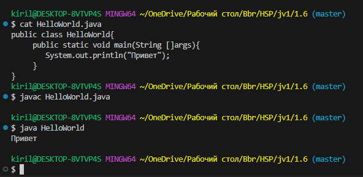
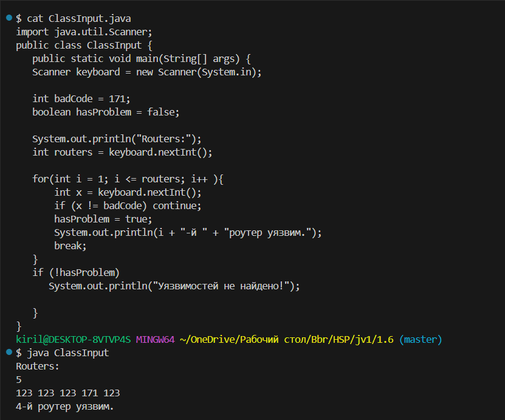

* ### Рефлексия 4.1. Композиция для двух иерархий классов.  
  Сделал подобным образом, только композиция была у класса Player. Помимо использования встроенных типов для обычных полей, было добавлено два поля с заранее определенными классами(Weapon, Character). У игрока есть выбранный персонаж и оружие.

* ### Рефлексия 4.2. Добавим метод foo() в каждый класс иерархии:  
  Получил аналогичный вывод программы. Но умозаключение было не совсем верным. Суть была в том, что можем быть уверенны, что у дочернего класса вызовется свой метод.

* ### Задание 1
  Сам этот файл.

* ### Задание 2
  
  ---
  

