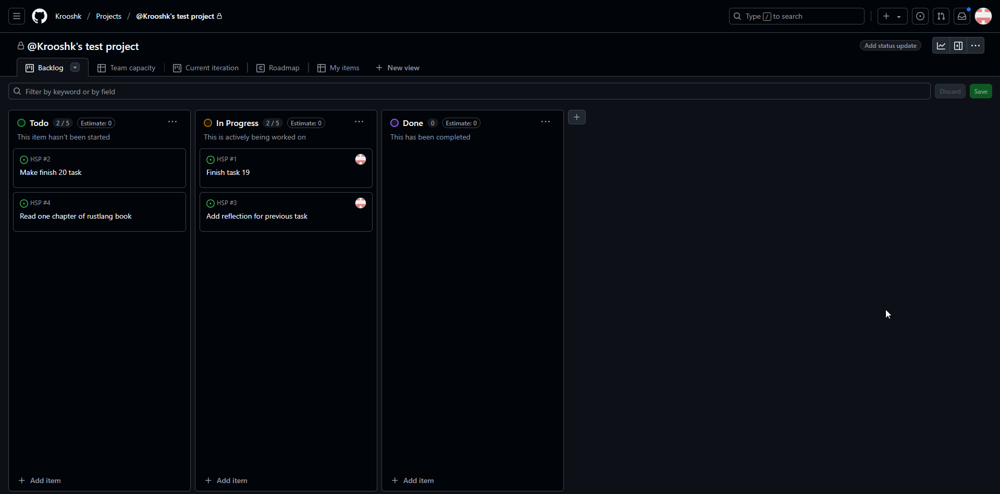

### Задание:

Общий проект:

---

Описание задачи подробно:

---

### Рефлексия:

#### Задание 1:
> Оличается заполнение массива случайными значениями. Интересный подход с уменьшением i, если такое число уже имеется. Случайные значения для массива делал немного иначе. Заполнял по порядку значения, а затем применял перемешивание, которое похоже на сортировку(только смена двух ячеек в массива определялась с помощью Random).
Неправильно понял, какие пары надо составить в отношении значения. Оказалось, что ключ - рандомное значение, как и реализовал, а значение это индекс + строка "value". Очистку мапы делал с помощью метода clear для всех значений, а не для каждого с помощью метода remove.

#### Задание 2:
> "Random rand = new Random()" лучше было вынести за пределы цикла. При создании экземляров HashMap, ArrayList не прописывал типы внутри угловых скобок, хотя слева типы определял. Использовал другие циклы (без счетчика), которые просто идут по элементам. Интересное решение добавлять в ArrayList значение, как только оно достигнет требумого, я вместо этого проходился циклом еще раз. Переменную со старым значением можно было не писать, а сделать таким образом: "t.put(key, t.get(key)+1)". В остальном решение аналогично.